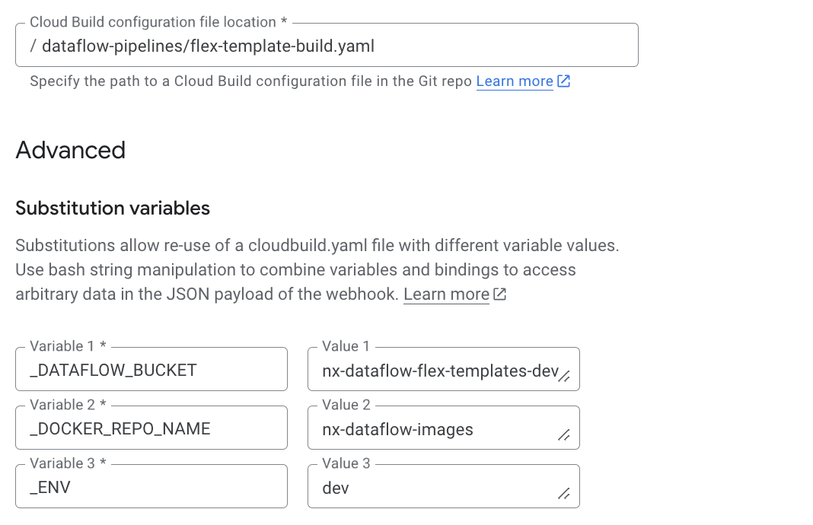
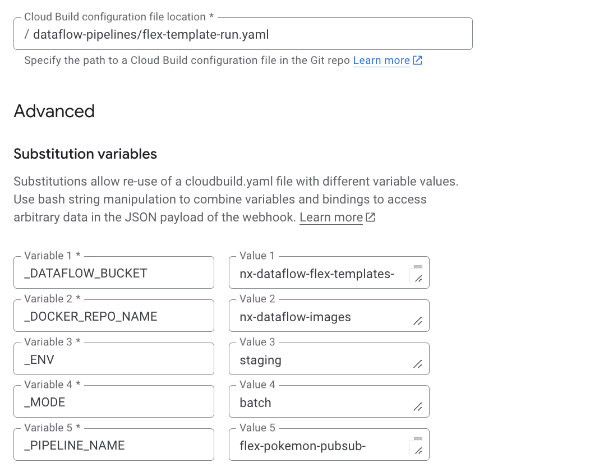

# JIRA tickets
To setup Dataflow pipelines using custom Python package along with a Cloud Build CI/CD, here is the list of tasks to be performed:

We assume that each environment has its own dedicated GCP project.

In `develop` GCP project:
1. Enable the following APIs: Artifact Registry API, Cloud Build API, Dataflow API, and Secret Manager API.
2. Create an Artifact Registry Docker repository named `nx-dataflow-images` in the `europe-west1` region.
3. Create Cloud Build service account `sa-cloud-build` with following roles:
    - Artifact Registry Writer
    - Cloud Build Editor
    - Logs Writer
    - Service Account User
    - Storage Object User
    - Dataflow Developer
4. It is recommended to [replace the worker service account with a user-managed service account](https://cloud.google.com/dataflow/docs/concepts/security-and-permissions#permissions).
5. Create `nx-dataflow-flex-templates-dev` Cloud Storage bucket for Dataflow templates and artifacts.
6. Create a `github-connection` host connection and connect it to your Dataflow GitHub repository.
7. Create Cloud Build 2nd gen trigger with `push to feature/ branch` event linked to your Dataflow GitHub repository.  Attach `sa-cloud-build` to the trigger. Apply following configuration:

8. Create Cloud Build 2nd gen trigger with `manual invocation` response linked to Dataflow GitHub repository.  Attach `sa-cloud-build` to the trigger. Apply following configuration:

In `staging` GCP project:
1. Enable the following APIs: Artifact Registry API, Cloud Build API, Dataflow API, and Secret Manager API.
2. Create an Artifact Registry Docker repository named `nx-dataflow-images` in the `europe-west1` region.
3. Create Cloud Build service account `sa-cloud-build` with following roles:
    - Artifact Registry Writer
    - Cloud Build Editor
    - Logs Writer
    - Service Account User
    - Storage Object User
    - Dataflow Developer
4. It is recommended to [replace the worker service account with a user-managed service account](https://cloud.google.com/dataflow/docs/concepts/security-and-permissions#permissions).
5. Create `nx-dataflow-flex-templates-staging` Cloud Storage bucket for Dataflow templates and artifacts.
6. Create a `github-connection` host connection and connect it to your Dataflow GitHub repository.
7. Create Cloud Build 2nd gen trigger with `push to main branch` event linked to Dataflow GitHub repository. Attach `sa-cloud-build` to the trigger. Apply following configuration:

8. Create Cloud Build 2nd gen trigger with `manual invocation` response linked to Dataflow GitHub repository. Attach `sa-cloud-build` to the trigger. Apply following configuration:

